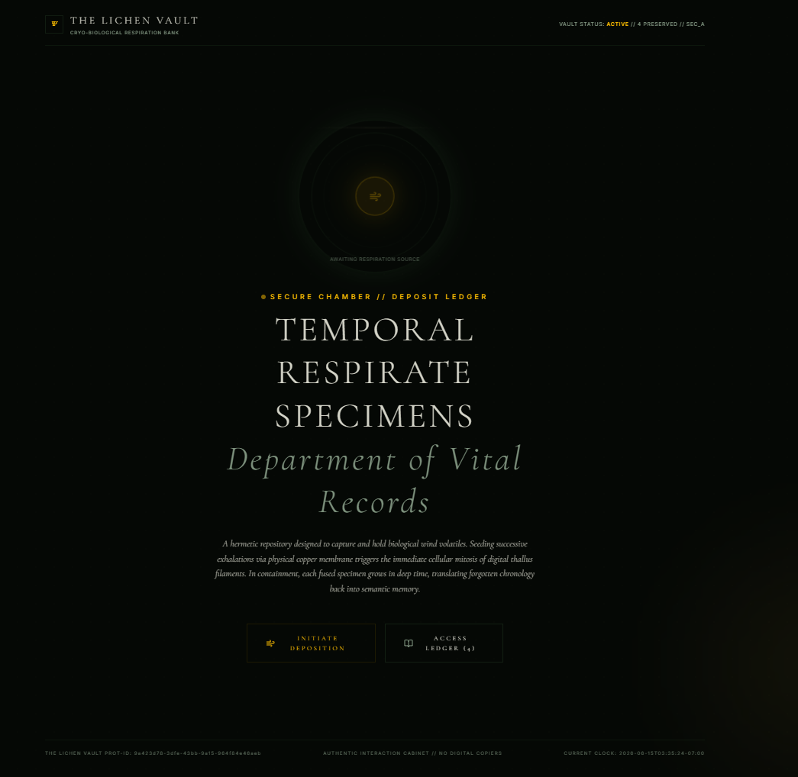
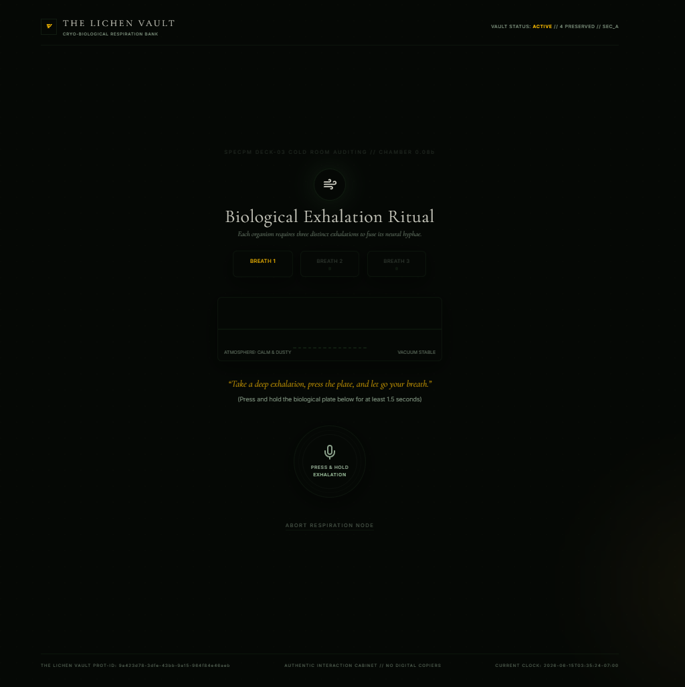
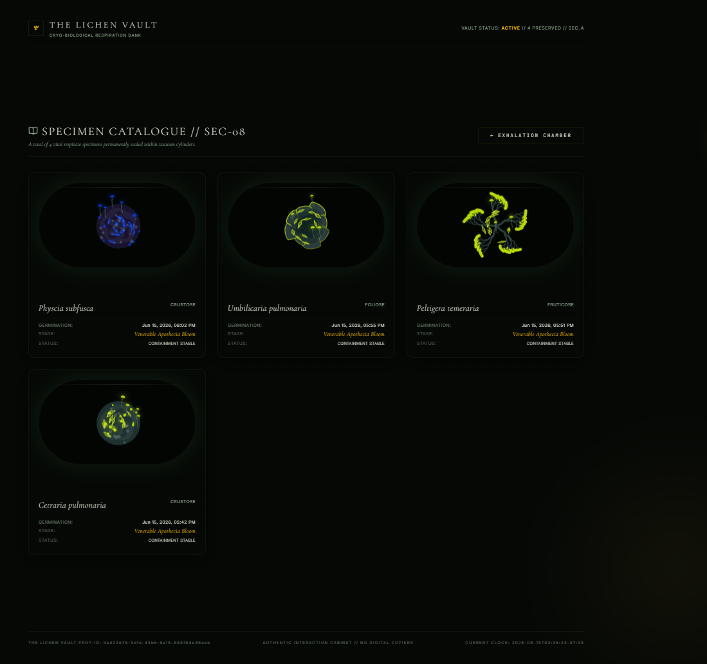

<p align="center">
  
</p>

<h1 align="center">The Lichen Vault</h1>

<p align="center">
  A breath-driven digital herbarium and Capstone foundation for privacy-preserving specimen agents.
</p>

<p align="center">
  
  
  
  
</p>

The Lichen Vault turns a three-breath deposition ritual into a persistent procedural lichen specimen. The current checkpoint keeps the original museum-cabinet experience while adding a real evidence-grounded agent workflow, trace inspection, human approval controls, ADK-backed Archivist integration, and a Vault MCP surface.

## Preview

| Breath ritual | Specimen chamber |
| --- | --- |
|  |  |

## Problem

Most generative demos stop at the moment of creation. This project explores the harder shape of an agentic system: private user-owned artifacts that must persist, migrate, recover from corrupt local state, and later support evidence-grounded agent decisions without inventing provenance.

## Current Solution

- Three-step breath capture ritual with microphone input and simulated fallback.
- Deterministic Canvas 2D lichen renderer using seeded growth parameters.
- Canonical `Specimen` domain model with `LichenOrganism` retained only as a compatibility alias.
- Runtime Zod validation on storage reads, migration output, specimen writes, event writes, and the observation API request body.
- Local vault persistence through `LocalStorageSpecimenRepository` instead of raw app-level `localStorage` parsing.
- Legacy record migration with deterministic missing seed/time derivation.
- Corruption recovery UI that exposes the failed key, reason, raw payload, retry, copy, ignore, and explicit reset paths.
- Event ledger support with idempotent duplicate appends and deterministic ordering.
- Evidence-grounded Archivist observations through a controlled ADK adapter, with local fallback when no key is configured or model output fails validation.
- Persisted workflow sessions, trace events, evidence records, and intervention proposals.
- Human approval panel for high-risk proposals; approval/rejection is idempotent and cannot be performed by an agent context.
- Vault MCP stdio server with schema-validated tools and policy-protected writes.
- Safe `/health` endpoint, structured redacted server logs, bounded model retries, model request timeout, and configurable rate limiting for model-backed endpoints.

## Completed Architecture

The current foundation includes modular domain entities for specimens, evidence records, episodic events, traces, workflows, and intervention proposals. Repository interfaces decouple the React app from storage details, while the localStorage implementation uses a v2 envelope and keeps compatibility with the original array-based records.

Persistence uses a transaction-like staged write with rollback across specimen snapshots and event records. Browser storage cannot provide true multi-key atomicity, so the implementation validates first, captures previous values, writes both stores, verifies the result, and restores previous values if a staged write fails.

## Agent Workflow

The implemented vertical slice is:

Capture or simulation -> Signal Curator -> evidence persistence -> Growth Simulator -> Archivist Agent -> policy validation -> event persistence -> trace persistence -> UI update.

Signal curation, quality checks, seed generation, growth simulation, policy, persistence, migration, and evidence validation are deterministic. The LLM is used only by the Archivist to write a short museum-style observation from persisted evidence. If ADK/model access is missing, fails, times out, returns invalid output, or cites nonexistent evidence, the workflow writes a local fallback observation and a fallback trace. Retry is bounded and reserved for retryable transient failures.

## Domain And Persistence

`Specimen` is the canonical persisted domain entity. Legacy observations are not upgraded into false certainty:

- `gemini` observations require real evidence ids and `grounded` verification; confidence remains `null` unless a transparent heuristic is explicitly supplied.
- `local_fallback` observations may omit evidence and are marked `fallback`.
- `legacy_unverified` observations preserve original text with empty evidence, `null` confidence, and `unverified` status.

Migration is deterministic and idempotent: the same legacy record produces the same specimen, already migrated specimens are accepted without destructive transformation, malformed JSON raises a typed recovery error, and unsupported future versions fail safely.

## Privacy

Specimens are stored locally in the browser under The Lichen Vault storage keys. Breath audio is not uploaded; the microphone stream is used client-side to derive simple duration, intensity, and cadence metrics during the ritual.

`GEMINI_API_KEY` is optional. Without it, the app remains functional through local fallback observation text. When Gemini is enabled, the server sends only bounded specimen context and persisted evidence summaries to `/api/archivist/observe`. Raw microphone audio is never uploaded, logged, or sent to a model.

## Requirements

- Node.js 20 or newer
- npm 10 or newer
- Optional Gemini API key for AI-generated archival observations

## Development Setup

```bash
npm ci
cp .env.example .env
npm run dev
```

Open `http://localhost:3000`.

## Environment Variables

| Variable | Required | Description |
| --- | --- | --- |
| `GEMINI_API_KEY` | No | Enables Gemini-generated observation entries. Without it, the server returns local fallback entries. |
| `GOOGLE_API_KEY` | No | Alternative model key accepted by the ADK runtime. |
| `GEMINI_MODEL` | No | Model identifier for the Archivist agent. Defaults to `gemini-2.5-flash`. |
| `MODEL_TIMEOUT_MS` | No | Per-model-call timeout. Defaults to `8000`. |
| `MAX_MODEL_ATTEMPTS` | No | Bounded model attempts. Defaults to `2`; deterministic validation/config failures are not retried. |
| `MODEL_RATE_LIMIT_WINDOW_MS` | No | Rate-limit window for model-backed endpoints when a model key is configured. Defaults to `60000`. |
| `MODEL_RATE_LIMIT_MAX` | No | Maximum model-backed requests per window when a model key is configured. Defaults to `12`. |
| `APP_URL` | No | Public app URL for deployments that need self-referential links. |

Cloud Run secrets and service URLs should be injected through deployment configuration. `.env.example` contains placeholders only.

## Scripts

```bash
npm run dev            # Start the Express + Vite development server
npm run lint           # Type-check the project
npm run test           # Run Vitest tests
npm run eval           # Run fake-model workflow, MCP, and operational evaluation tests
npm run mcp:dev        # Start the Vault MCP stdio server
npm run mcp:check      # Dry-run the MCP server and list exposed tools
npm run build          # Build the client and bundled production server
npm run start          # Serve the production build from dist/
npm run preview        # Build, then start the production server
npm run release:check  # Run lint, tests, and build
npm run clean          # Remove generated local build artifacts
```

## Production Build

```bash
npm run release:check
npm run start
```

The production server serves `dist/`, falls back to `index.html` for SPA routes, listens on `0.0.0.0`, and respects a valid `PORT` environment variable. `/health` returns safe service status, model configuration state, ADK package participation, rate-limit configuration, and current server time. It does not expose API keys, authorization data, specimen data, or raw environment values.

Model-backed endpoints emit structured JSON logs with request ids, workflow ids when available, operation, status, duration/fallback fields, and redacted error context. Model rate limiting applies only when a real model key is configured, so the no-key local fallback path remains available for development and demos.

## Vault MCP Server

The Vault MCP server runs as a separate stdio process:

```bash
npm run mcp:check
npm run mcp:dev
```

It exposes schema-validated tools for specimen reads, event/evidence/trace reads, fallback observation appends, intervention proposals, trusted approval/rejection, and versioned specimen export. Direct destructive tools such as `delete_specimen` are intentionally absent.

Approval, rejection, and export require an application-controlled trusted action validator. The default standalone stdio server exposes the schemas but does not grant autonomous approval authority by itself; callers must integrate a separate human-confirmation boundary before those actions can succeed.

## Demo Flow

```bash
npm ci
npm run dev
```

Open `http://localhost:3000`, perform the three-breath ritual, then inspect the new specimen in the cabinet. The Trace panel shows persisted workflow steps. The Human Approval panel shows the high-risk export proposal; approving or rejecting it records an idempotent event and trace.

## Architecture And Evaluation Docs

- `docs/architecture.md`
- `docs/evaluation.md`

## Limitations

- Browser `localStorage` provides best-effort consistency only; the repository implements staged writes with rollback, not true database transactions.
- The MCP stdio server uses an in-memory repository by default; browser localStorage remains the app's primary local-first store.
- The ADK Archivist adapter is server-side only. The primary test suite uses fake model behavior and does not require a real Gemini key.
- Screenshots document the current visual experience; they are not an automated visual regression suite.

## Project Evolution

The original MVP established the identity, breath ritual, renderer, vault inspection flow, optional Gemini fallback, and production-buildable Express/Vite server. This checkpoint preserves those strengths while replacing direct app-level storage access with validated domain repositories and explicit recovery behavior.
